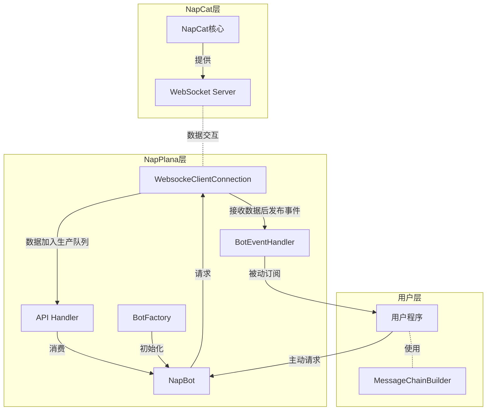

# {{ $frontmatter.title }}

> お待ちしておりました。
> 
> 已经恭候多时了。
> 
> ——Plana

## 另一扇大门

欢迎使用NapPlana.NET!

这是一个.NET 平台下的[NapCat](https://github.com/NapNeko/NapCatQQ)框架的SDK实现，旨在为开发者提供在.NET平台下开发QQ机器人的又一个解决方案

名字的灵感来源于《蔚蓝档案》系列的角色普拉那 ( Plana ，星奈)，算是我的一点小小私货，毕竟在原作中也是AI，所以用在QQ机器人相关项目上应该很合理吧(大嘘)

框架提供了一套相对简洁高效的方案来进行QQ机器人开发，可帮助你从零快速完成一个简单的QQ机器人，也方便你进一步开发

本文档会提供一套相对完整的开发流程，从零开始教你创建一个机器人，然后说明项目里比较重要的内容，最后提供全套的API文档。

总之，准备好你的NapCat服务器，就可以从侧边栏找你需要的内容即可。

如果对其他内容感兴趣，也可以在这里留下来。

> 特别鸣谢[@芋泥雪糕喵](https://www.mihuashi.com/profiles/155732?role=painter)制作的logo

## 项目架构

## 项目状态

| Nuget                                                 | License | Workflow                                                                                                | Name Inspired By                                    | Github                                                                     |
|-------------------------------------------------------|---------|---------------------------------------------------------------------------------------------------------|-----------------------------------------------------|----------------------------------------------------------------------------|
|  |    |  |  |  |

## 后记

不写了，这两天把这玩意写完了就得去忙考研了